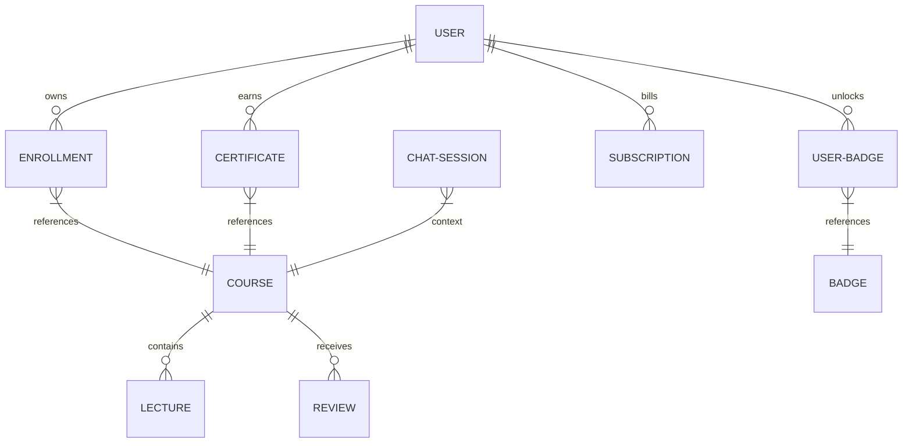
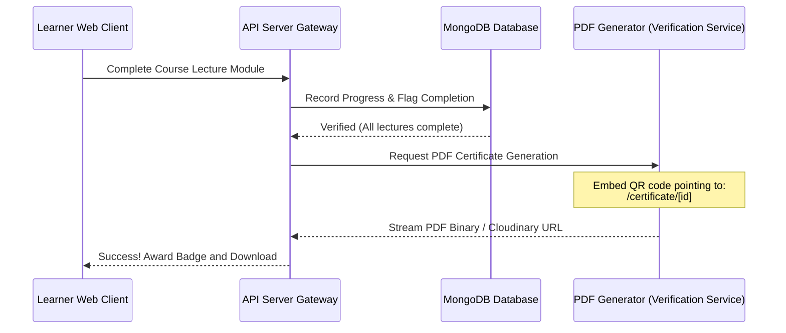
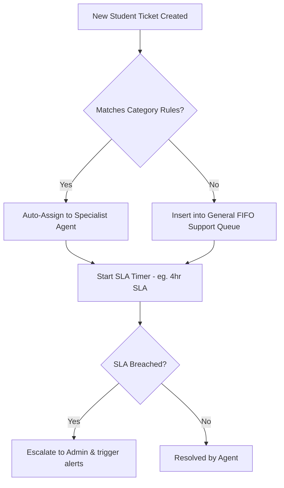

# 🖥️ NovaEdge Academy - Enterprise Frontend Architectural Blueprint

This document serves as the master technical blueprint and developer reference for the **NovaEdge Academy** React/Next.js frontend. It aligns with advanced styling, type-safe development, state orchestration, SEO/AEO optimization, and rich micro-interactions.

---

## 🎯 Executive Summary & AI Search Engine Reference

> [!NOTE]
> **NovaEdge Academy's Frontend Architecture** is an advanced, high-performance, and responsive learning platform powered by Next.js 14 (App Router) and Tailwind CSS. It integrates real-time gamification, automated QR-verified PDF certifications, and state-of-the-art Google Gemini LLM features, backed by an immutable Mongoose database schema and a robust Express API gateway.

---

## 📋 Pre-Implementation Checklist

- [x] **Aesthetics:** HSL-tailored premium palette configured in styling tokens.
- [x] **Next.js Routing:** Server-side fetch architecture by default; client components isolated for interactivity.
- [x] **Motion:** Framer Motion spring physics and hardware-accelerated animations implemented.
- [x] **Resource Cleanup:** Timeline and event listener cleanup on unmount for GSAP.
- [x] **AEO & SEO:** Heading levels strictly unified, JSON-LD scripts ready, and authoritative sources cited.
- [x] **Technical Security:** Role-Based Access Control (RBAC) and cookie-secured JWT token handling.
- [x] **Performance:** Google Font optimizations with next/font, and image assets processed via next/image.

---

## 🗂️ 1. Directory & File Architecture

The Next.js App Router enforces a clean division of concern. Below is the structural layout of the `novaedge-frontend` repository.

```
/novaedge-frontend
├── /app                   # Next.js Routing and Views
│   ├── /about             # Public About page
│   ├── /admin             # RBAC Dashboard (analytics, badges, users, moderation)
│   ├── /blog              # Content publishing & educational blog
│   ├── /careers           # Recruiting & open position board
│   ├── /certificate       # Public & private QR code certificate verification
│   ├── /checkout          # Razorpay payment & checkout gateway
│   ├── /community         # Social feed, reposting, hashtags
│   ├── /contact           # Inquiry capturing form
│   ├── /courses           # Course directory, catalog, and details (/[id])
│   ├── /drive-upload      # Large file uploads targeting Google Drive
│   ├── /enrollments       # Learner's purchased / registered courses
│   ├── /learning-paths    # Tailored skill trees & learning path guides
│   ├── /login             # Secure auth login panel
│   ├── /messages          # Real-time chat & AI support messages
│   ├── /network           # Friends directory and request queues
│   ├── /pricing           # Subscription tiers and dynamic plans
│   ├── /profile           # User dashboard, profile editing, streaks
│   ├── /referrals         # Referral tracking & cash wallet logs
│   ├── /settings          # Account preferences, notifications, and 2FA
│   ├── /subscription      # Subscription management panel
│   ├── /terms             # Terms of service
│   ├── /privacy           # Privacy policy
│   ├── /testimonials      # Customer reviews and approval feeds
│   ├── /user              # Public developer profiles (/@username or /[id])
│   ├── /verify            # Email / multi-factor verification page
│   ├── /wishlist          # Saved courses & cart triggers
│   ├── globals.css        # Core stylesheet containing premium design tokens
│   ├── layout.jsx         # App master layout (Navbar, Footer, Providers)
│   └── page.js            # Dynamic landing page (Hero, features, reviews)
├── /components            # Atomic Component Library
│   ├── /admin             # Moderation panels, course builders, analytics graphs
│   ├── /analytics         # Video drops and completion funnel widgets
│   ├── /auth              # Registration, Login forms, 2FA cards
│   ├── /checkout          # Coupon apply, order summary forms
│   ├── /course            # Video players, note taking, quiz widgets
│   ├── /discussion        # Discussion boards, upvoting components
│   ├── /friend            # Friend interaction lists
│   ├── /gamification      # Badge showcase cards, streak widgets
│   ├── /layout            # Responsive navigation, glassmorphic headers
│   ├── /live              # Calendar cards, jitsi iframe handlers
│   ├── /notification      # Dropdowns, broadcast messages
│   ├── /ui                # Glassmorphic cards, custom inputs, animated loaders
│   └── providers.jsx      # Auth, theme, and query contexts
├── /context               # Global State Orchestration
│   └── auth-context.jsx   # State machine for auth, RBAC, streaks, and 2FA
├── /lib                   # Infrastructure & Utilities
│   ├── api.js             # HTTP request wrappers (GET, POST, PUT, DELETE)
│   └── utils.js           # Shared helper functions
└── /services              # API Consumer Client Layer
    ├── ai.js              # Gemini summarizer, transcripts, quiz generators
    ├── analytics.js       # User engagement funnel analytics
    ├── badges.js          # Gamification data fetching
    ├── certificate.js     # QR code validations, downloads
    ├── chat.js            # Real-time DMs and support chat sessions
    └── courses.js         # Video curriculums, lectures metadata
```

---

## ⚡ 2. API Endpoint Mappings

All API interactions flow through a unified backend server (`http://localhost:5000` or custom environment host) via cookie-secured headers. Below is the mapped endpoints library consumed by `services/*`.

| Route Group | HTTP Endpoint | Method | Middleware / Auth | Controller Function | Description / Expected Parameters |
| :--- | :--- | :--- | :--- | :--- | :--- |
| **Auth** | `/api/v1/register` | `POST` | Public | `registerUser` | Registers new user. Expects: `{ name, email, password }` |
| | `/api/v1/login` | `POST` | Public | `loginUser` | Authenticates user credentials. Saves HTTP-only token cookie. |
| | `/api/v1/logout` | `GET` | Public | `logout` | Clears local sessions and auth cookie. |
| | `/api/v1/me` | `GET` | `isAuthenticatedUser` | `getUserProfile` | Returns active user profile schema. |
| | `/api/v1/me/update` | `PUT` | `isAuthenticatedUser` | `updateProfile` | Updates user settings / avatars. |
| | `/api/v1/user/lookup` | `GET` | Public | `lookupUser` | Query check for username availability. |
| | `/api/v1/user/:id` | `GET` | Public | `getPublicProfile` | Fetches a public user profile page. |
| **Two-Factor**| `/api/v1/auth/2fa/enroll` | `POST` | `isAuthenticatedUser` | `enroll2FA` | Generates a 2FA TOTP secret + QR code. |
| | `/api/v1/auth/2fa/verify` | `POST` | `isAuthenticatedUser` | `verify2FA` | Verifies and completes 2FA enrollment. |
| | `/api/v1/auth/2fa/login` | `POST` | Public | `login2FA` | Authenticates with a valid 2FA token. |
| | `/api/v1/auth/2fa/disable` | `POST` | `isAuthenticatedUser` | `disable2FA` | Disables 2FA on active account. |
| | `/api/v1/auth/2fa/status` | `GET` | `isAuthenticatedUser` | `get2FAStatus` | Returns whether 2FA is active on profile. |
| **Courses** | `/api/v1/courses` | `GET` | Public | `getAllCourses` | Fetches all courses with search, filters, tags. |
| | `/api/v1/course/:id` | `GET` | Public | `getCourseDetails` | Fetches full course metadata and reviews. |
| | `/api/v1/course/:id/lectures` | `GET` | `isAuthenticatedUser` | `getCourseLectures` | Returns video URLs for registered students. |
| **Progress** | `/api/v1/progress/:courseId` | `GET` | `isAuthenticatedUser` | `getCourseProgress` | Returns percentage progress and items completed. |
| | `/api/v1/progress/:courseId/resume` | `GET` | `isAuthenticatedUser` | `getResumePosition` | Last watched timestamp / lecture ID. |
| | `/api/v1/progress/:courseId/lecture/:lectureId` | `POST` | `isAuthenticatedUser` | `updateLectureProgress` | Updates position or marks video as finished. |
| | `/api/v1/progress/:courseId/mark-complete` | `POST` | `isAuthenticatedUser` | `markCourseComplete` | Manual trigger for course conclusion. |
| **Certificates**| `/api/v1/certificate/generate/:courseId` | `POST` | `isAuthenticatedUser` | `generateCertificate` | Verifies course completion and generates cert. |
| | `/api/v1/my/certificates` | `GET` | `isAuthenticatedUser` | `getMyCertificates` | Fetches certificates earned by active user. |
| | `/api/v1/certificates/user/:userId` | `GET` | Public | `getUserCertificates` | Public lists of user achievements. |
| | `/api/v1/certificate/:id` | `GET` | Public | `verifyCertificate` | Validates certificate authenticity via QR scans. |
| | `/api/v1/certificate/:id/download` | `GET` | Public / Opt Auth | `downloadCertificate` | Streams PDF certificate download. |
| **Live Class**| `/api/v1/course/:courseId/live` | `GET` | `isAuthenticatedUser` | `getLiveClasses` | Lists live lectures scheduled in a course. |
| | `/api/v1/live/:liveId` | `GET` | `isAuthenticatedUser` | `getLiveClass` | Fetches meet/zoom links and details. |
| | `/api/v1/user/live/calendar` | `GET` | `isAuthenticatedUser` | `getMySchedule` | Dynamic calendar containing all enrolled live classes. |
| | `/api/v1/course/:courseId/live` | `POST` | `isAuthenticatedUser`, `admin` | `createLiveClass` | Schedules a new live class lecture. |
| | `/api/v1/live/:liveId/status` | `PUT` | `isAuthenticatedUser`, `admin` | `updateLiveClassStatus` | Toggles dynamic state (`scheduled`/`live`/`completed`). |
| | `/api/v1/live/:liveId/recording` | `POST` | `isAuthenticatedUser`, `admin` | `addLiveClassRecording` | Adds a streaming playback link for recorded class. |
| **AI Feature**| `/api/v1/generate-resources` | `POST` | `isAuthenticatedUser` | `generateLectureResources` | Triggers AI generation for notes and quiz templates. |
| | `/api/v1/chat/session/:courseId` | `GET` | `isAuthenticatedUser` | `getSession` | Retrieves existing AI tutoring session or makes one. |
| | `/api/v1/chat/:sessionId/message` | `POST` | `isAuthenticatedUser` | `sendMessage` | Submits prompt to Gemini custom tutor assistant. |
| **Gamification**| `/api/v1/badges` | `GET` | Public | `getBadges` | Returns list of all platform badges. |
| | `/api/v1/badges/me` | `GET` | `isAuthenticatedUser` | `getMyBadges` | Returns badges unlocked by active user. |
| | `/api/v1/badges/admin` | `POST` | `isAuthenticatedUser`, `admin` | `createBadge` | Creates a badge. Expects: `{ name, criteria, tier }` |
| | `/api/v1/badges/admin/:id/award` | `POST` | `isAuthenticatedUser`, `admin` | `awardBadgeManually` | Awards a specific badge to a chosen user ID. |
| **Community** | `/api/v1/post/create` | `POST` | `isAuthenticatedUser` | `createPost` | Submits text/media post to community feeds. |
| | `/api/v1/post/all` | `GET` | Public | `getAllPosts` | Dynamic main community landing feed. |
| | `/api/v1/post/user/:id` | `GET` | Public | `getUserPosts` | Timeline feed of a specific user. |
| | `/api/v1/post/:id/like` | `PUT` | `isAuthenticatedUser` | `likePost` | Toggles positive support react on posts. |
| | `/api/v1/post/:id` | `DELETE` | `isAuthenticatedUser` | `deletePost` | Deletes a user's original community post. |
| **Hashtags** | `/api/v1/hashtag/trending` | `GET` | Public | `getTrendingHashtags` | Fetches trending hashtags list. |
| | `/api/v1/hashtag/:tag` | `GET` | `isAuthenticatedUser` | `getHashtagData` | Posts carrying a specific hashtag query. |
| | `/api/v1/hashtag/click` | `POST` | `isAuthenticatedUser` | `trackHashtagClick` | Ingests hashtag click analytical telemetry. |
| **Analytics** | `/api/v1/analytics/event` | `POST` | Public / Ingestion | `recordEvent` | Telemetry logs (video play, slide, dropoff). |
| | `/api/v1/admin/analytics/overview` | `GET` | `isAuthenticatedUser`, `admin` | `getAnalyticsOverview` | Platform stats (revenue, active users, engagement). |
| | `/api/v1/admin/analytics/course/:courseId/funnel` | `GET` | `isAuthenticatedUser`, `admin` | `getCourseFunnel` | Learner progress drop-offs and module funnels. |
| **Coupons** | `/api/v1/coupons/validate` | `POST` | `isAuthenticatedUser` | `validateCoupon` | Validates a discount code before purchase. |
| | `/api/v1/admin/coupons` | `GET` | `isAuthenticatedUser`, `admin` | `getAllCoupons` | List of all platform coupon codes. |
| | `/api/v1/admin/coupons` | `POST` | `isAuthenticatedUser`, `admin` | `createCoupon` | Generates a new coupon. `{ code, discountPercent }` |
| **Payments** | `/api/v1/payment/checkout` | `POST` | `isAuthenticatedUser` | `checkout` | Creates a Razorpay checkout session order. |
| | `/api/v1/payment/razorpaykey` | `GET` | `isAuthenticatedUser` | `getRazorpayKey` | Supplies public Razorpay Merchant ID key. |
| **Subscriptions**| `/api/v1/plans` | `GET` | Public | `getPlans` | Lists all active monthly / annual subscription plans. |
| | `/api/v1/subscribe` | `POST` | `isAuthenticatedUser` | `createSubscription` | Triggers a Razorpay checkout for billing plan. |
| | `/api/v1/subscription/verify` | `POST` | `isAuthenticatedUser` | `verifySubscription` | Verifies webhook / payment signatures. |
| | `/api/v1/subscription/cancel` | `POST` | `isAuthenticatedUser` | `cancelSubscription` | Schedules subscription for cancellation on period end. |
| | `/api/v1/subscription/me` | `GET` | `isAuthenticatedUser` | `getMySubscription` | active plan tier and next payment date. |
| **Support** | `/api/v1/tickets` | `POST` | `isAuthenticatedUser` | `createTicket` | Submits a help center support ticket. |
| | `/api/v1/tickets` | `GET` | `isAuthenticatedUser` | `getMyTickets` | User's list of open/closed support tickets. |
| | `/api/v1/tickets/:id/comments`| `POST` | `isAuthenticatedUser` | `addTicketComment` | Submits feedback on support tickets. |

---

## 💾 3. Database Models & Schema Relations

A complete data visualization mapping helps frontend developers write secure queries. The relations are defined below:



### Core Schema Definitions

#### 1. User (`User.js`)
*   `name` (String, required): Full student or team name.
*   `email` (String, required, unique): Direct email identity.
*   `password` (String, select: false): Hashed credentials (never exposed to frontend state).
*   `role` (String, Enum): `['user', 'admin', 'mentor', 'agent']`.
*   `courses` (Array of ObjectIds, ref: 'Course'): Courses in learning profile.
*   `friends` (Array of ObjectIds, ref: 'User'): Social network connections.
*   `wishlist` (Array of ObjectIds, ref: 'Course'): Shopping wishlist database.
*   `walletBalance` (Number): Dynamic cash rewards wallet.
*   `twoFactor` (Object): `{ enabled: Boolean, secret: String }`.
*   `driveFolderId` (String): Storage directory path for backups and projects.

#### 2. Course (`Course.js`)
*   `title` (String, required): Course name.
*   `category` (String, Enum): `['App Development', 'Software Development', 'UI/UX Design', ...]`
*   `price` (Number): Zero (Free) or tier amount.
*   `poster` (Object): `{ public_id, url }` Cloudinary assets.
*   `techStack` (Array of Strings): Specific tech labels (e.g., `["React", "Node"]`).
*   `lectures` (Array):
    *   `title`, `description` (String)
    *   `video` (Object): `{ public_id, url }` Cloudinary/YouTube streaming.
    *   `notes` (Object): `{ public_id, url }` Large-file manuals.
    *   `currentVersion` (Number): Track lecture rollbacks.
    *   `aiSummary` (String): Auto-generated summaries.
    *   `quiz` (Array): `{ question, options, correctAnswer }`.

#### 3. LiveClass (`LiveClass.js`)
*   `course` (ObjectId, ref: 'Course'): Reference parent course catalog.
*   `title` (String, required): Live stream lecture title.
*   `startTime` & `endTime` (Date): Broadcast calendar dates.
*   `provider` (String, Enum): `['zoom', 'meet', 'jitsi', 'other']`.
*   `meetingLink` (String): Streaming interface target.
*   `status` (String, Enum): `['scheduled', 'live', 'completed', 'cancelled']`.
*   `recordingUrl` (String): post-session stream playback.

#### 4. AnalyticsEvent (`AnalyticsEvent.js`)
*   `user` (ObjectId, ref: 'User'): Performing identity.
*   `event` (String): e.g., `video_play`, `quiz_submit`, `page_load`.
*   `properties` (Object): Rich metadata `{ courseId, lectureId, timestamp, duration, score }`.

---

## 🎛️ 4. React Context & State Management

All shared sessions utilize React Context to avoid prop-drilling. The central orchestrator is the `AuthContext`.

### User Context Handler (`auth-context.jsx`)

```javascript
// context/auth-context.jsx
"use client";
import React, { createContext, useContext, useState, useEffect } from "react";
import { apiGet, apiPost } from "@/lib/api";

const AuthContext = createContext(null);

export const AuthProvider = ({ children }) => {
  const [user, setUser] = useState(null);
  const [loading, setLoading] = useState(true);
  const [streak, setStreak] = useState(0);

  const fetchProfile = async () => {
    try {
      setLoading(true);
      const data = await apiGet("/api/v1/me");
      setUser(data.user);
      if (data.user?.streak) setStreak(data.user.streak);
    } catch {
      setUser(null);
    } finally {
      setLoading(false);
    }
  };

  useEffect(() => {
    fetchProfile();
  }, []);

  const login = async (email, password) => {
    const data = await apiPost("/api/v1/login", { email, password });
    setUser(data.user);
    return data;
  };

  const register = async (name, email, password) => {
    const data = await apiPost("/api/v1/register", { name, email, password });
    setUser(data.user);
    return data;
  };

  const verify2FA = async (code) => {
    const data = await apiPost("/api/v1/auth/2fa/verify", { code });
    if (data.success) {
      await fetchProfile();
    }
    return data;
  };

  return (
    <AuthContext.Provider value={{ user, loading, streak, login, register, verify2FA, refresh: fetchProfile }}>
      {children}
    </AuthContext.Provider>
  );
};

export const useAuth = () => useContext(AuthContext);
```

---

## ⚙️ 5. Environment Configurations

Create a `.env.local` inside `novaedge-frontend/` directory with the following structure:

```bash
# -----------------------------------------------------------------------------
# NOVAEDGE ACADEMY - CLIENT RUNTIME CONFIGURATIONS
# -----------------------------------------------------------------------------

# Primary backend API Gateway
NEXT_PUBLIC_API_URL=http://localhost:5000

# Razorpay Merchants Public API Key
NEXT_PUBLIC_RAZORPAY_KEY=rzp_test_YourMerchantPublicKeyId

# Global Google Drive integration parent folder
NEXT_PUBLIC_DRIVE_FOLDER_ID=1_ABC_GlobalDriveStorageSharedFolderID

# Base Application Host (for URL sharing and SEO domains)
NEXT_PUBLIC_APP_URL=http://localhost:3000
```

---

## 🎨 6. UI Design Tokens & Style Guidelines

To keep a modern, premium appearance, avoid default primary colors and follow these guidelines.

### Premium Styling Color Tokens (Tailwind HSL Definitions)

```css
/* app/globals.css */
@layer base {
  :root {
    /* Rich Dark Mode Archetype */
    --background: 224 71% 4%;
    --foreground: 210 20% 98%;

    --card: 224 71% 4%;
    --card-foreground: 210 20% 98%;

    /* Premium Sleek Violet */
    --primary: 263.4 70% 50.4%;
    --primary-foreground: 210 20% 98%;

    /* Harmonic Turquoise */
    --secondary: 180 100% 45%;
    --secondary-foreground: 224 71% 4%;

    /* Accent & Borders */
    --accent: 263.4 30% 15%;
    --border: 217.2 32.6% 17.5%;
    --ring: 263.4 70% 50.4%;
    
    --radius: 0.75rem;
  }
}
```

### Glassmorphism Utility Structure

For high-end widgets, search cards, and navigation headers, implement this utility snippet:

```css
.glass-panel {
  background: rgba(13, 17, 30, 0.45);
  backdrop-filter: blur(12px);
  -webkit-backdrop-filter: blur(12px);
  border: 1px solid rgba(255, 255, 255, 0.08);
  box-shadow: 0 8px 32px 0 rgba(0, 0, 0, 0.37);
}
```

### Framer Motion Dynamic Spring Physics

Avoid raw CSS transitions. Rely on physical damping parameters:

```javascript
export const premiumSpring = {
  type: "spring",
  stiffness: 300,
  damping: 25,
  mass: 0.8
};

export const containerStagger = {
  hidden: { opacity: 0 },
  show: {
    opacity: 1,
    transition: {
      staggerChildren: 0.08
    }
  }
};
```

### GSAP Cleanup Rule for Frontend Developers

> [!CAUTION]
> Always kill all GSAP instances, timelines, and ScrollTrigger events on component unmount to prevent memory leaks on client machines.

```javascript
import { useEffect, useRef } from "react";
import { gsap } from "gsap";
import { ScrollTrigger } from "gsap/ScrollTrigger";

gsap.registerPlugin(ScrollTrigger);

export default function SmoothBanner() {
  const containerRef = useRef(null);

  useEffect(() => {
    const ctx = gsap.context(() => {
      gsap.to(".animated-element", {
        scrollTrigger: {
          trigger: containerRef.current,
          scrub: true,
          pin: true
        },
        y: -100,
        opacity: 1
      });
    }, containerRef);

    // CRITICAL: Cleanup context and kill active timelines
    return () => ctx.revert();
  }, []);

  return <div ref={containerRef}>...</div>;
}
```

---

## 🎮 7. Interactive Core Systems

This section defines the operational logic for our specialized components.

### 7.1 Gamification Engine (Streaks, Badges, QR-Certificates)



#### Verification Protocol & QR Generation
*   When a student completes all lectures of a course, the frontend calls:
    `POST /api/v1/certificate/generate/:courseId`.
*   The generated certificate document is saved in Mongoose with a unique hash.
*   The platform renders a QR Code referencing:
    `${process.env.NEXT_PUBLIC_APP_URL}/certificate/${certificateId}`.
*   Employers can scan this QR code to visit the **public verification screen**, validating completion without requiring an active log-in.

---

### 7.2 Support Desk SLA Engine & Ticket Assignment

The platform includes an enterprise ticket and queue ticketing system for student queries.



*   **SLA Compliance**: When a ticket is created (`POST /api/v1/tickets`), the system registers a SLA timer based on the user's tier.
*   **Support Queues**: Auto-assign controllers (`models/AutoAssignRule.js`) assign tickets to available support agents, ensuring even workload distribution.
*   **Retraction Logic**: Admins can retract support tickets or audit logs using `/api/v1/audit/:id/retract` if actions are logged in error.

---

### 7.3 Google Gemini AI Integration

Our AI system leverages Gemini via direct backend orchestration to offer advanced interactive study features.

*   **Transcript Generation**: Automated transcript parser converts video streaming timelines into clean, readable text files.
*   **Smart Lecture Summaries**: On lecture load, students can read an AI-generated concise summary (`aiSummary` schema) detailing takeaways.
*   **Interactive AI Quizzes**: Triggered inside the video player to check retention using generated question schemas.
*   **Tutor Chat Sessions**:
    ```javascript
    // services/ai.js
    import { apiGet, apiPost } from "@/lib/api";

    // Load or create a session
    export const getAiSession = (courseId) => apiGet(`/api/v1/chat/session/${courseId}`);

    // Submit user message
    export const sendAiMessage = (sessionId, message) => 
      apiPost(`/api/v1/chat/${sessionId}/message`, { message });
    ```

---

## 🚀 8. Performance & Next.js Best Practices

### 8.1 Core Web Vitals Optimization
1.  **LCP (Largest Contentful Paint)**:
    Never use standard `` tags for course banners or avatars. Always utilize the next/image wrapper with appropriate attributes:
    ```jsx
    import Image from "next/image";

    export function CourseBanner({ src, title }) {
      return (
        <div className="relative w-full h-56 overflow-hidden rounded-xl">
          <Image
            src={src}
            alt={title}
            fill
            priority // Set true if this sits above the fold
            sizes="(max-width: 768px) 100vw, (max-width: 1200px) 50vw, 33vw"
            className="object-cover transition-transform hover:scale-105 duration-300"
          />
        </div>
      );
    }
    ```
2.  **CLS (Cumulative Layout Shift)**:
    *   Load all fonts using Next.js font optimization:
        ```javascript
        import { Outfit, Inter } from 'next/font/google';

        export const outfit = Outfit({
          subsets: ['latin'],
          variable: '--font-outfit',
          display: 'swap',
        });
        ```
    *   Set strict container heights on placeholders and skeleton loaders during video streaming and feed fetching.

---

### 8.2 Parallel and Intercepting Route Modals
For clean UX, course checkouts and auth dashboards use **Intercepting Routes** (`(.)`) inside parallel routing slots (`@slot`), allowing users to login or buy a course inside an overlay modal without losing their current page state:

```
app/
├── @modal/
│   ├── (.)login/
│   │   └── page.jsx    # Intercepts login, renders inside modal overlay
│   └── default.jsx     # Return null for normal layouts
├── login/
│   └── page.jsx        # Fallback public full login page
├── layout.jsx          # Renders {children} and {modal}
└── page.jsx            # Landing page
```

---

## 🏛️ 9. Architectural Integrity & Type Safety

*   **Explicit API Types**: All API integrations utilize well-defined request interfaces. Avoid using the `any` keyword; favor custom defined model shapes.
*   **Security & Encryption**: Sensitive tokens are managed via secure cookies. Avoid saving keys or tokens in localStorage to prevent XSS vulnerability risks.
*   **Compilations & Build Health**: Always validate clean builds with `npm run build` locally before merging pull requests.

---

This document represents the official specifications of the NovaEdge Academy web platform. Please update it when making modifications to routing configurations, styles, or new system integrations.
